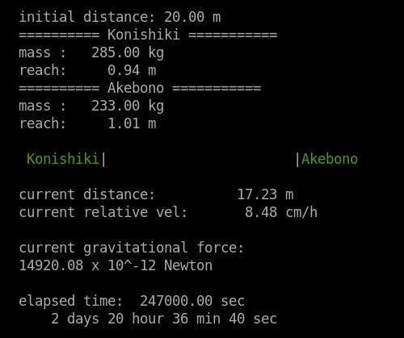

# gravtest

A simulation of a gravitational force between two objects on a straight line.



# compilation

```
mkdir build
cd build
cmake ..
make
```

Then, you can run the program.
```
./gravtest
```

